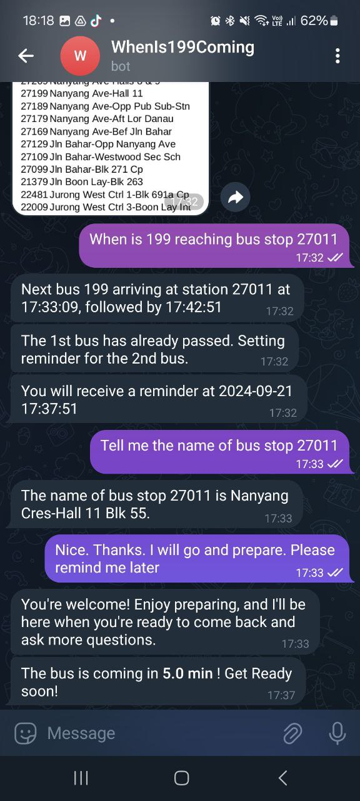

# WhenIs199Coming Telegram Bot

This is a simple Python application that notifies you when a specific bus is arriving at a specified bus stop using the **Singapore LTA Bus Arrival API**. The app integrates with the **Telegram Bot API** to send real-time notifications directly to your Telegram account. It also integrates large language model (LLM) to interpret user request and answer general questions.

## Features

- **Real-time notifications** for bus arrivals at selected bus stops.
- Configurable bus stop codes and bus service numbers.
- Fully automated notifications via a Telegram bot.
- Reminder before bus arival.
- LLM-assisted general conversations.

## Demo


## Prerequisites

- Python 3.8+
- A valid **Telegram bot token** (from BotFather)
- An API key for the **LTA DataMall Bus Arrival API**
- Libraries: 
  - `python-telegram-bot`
  - `requests`
  - `groq`

## Installation

1. **Clone the repository:**
    ```bash
    git clone https://github.com/davidlai0522/WhenIs199Coming.git
    cd WhenIs199Coming
    ```

2. **Install dependencies:**
    You can install the required Python libraries via pip:
    ```bash
    pip install -r requirements.txt
    ```

3. **Set up your environment:**

   Create `api.sh` file in the project directory with the following variables:
    ```bash
    #!/usr/bin/env bash
    export GROQ_API_KEY='xxxxx'
    export LTA_API_KEY='xxxxx'
    export TELEGRAM_TOKEN='xxxxx'
    ```

## Usage

### Step 1: Set Up the Telegram Bot

1. **Create a new bot** on Telegram by talking to [BotFather](https://t.me/botfather):
    - Type `/newbot` and follow the prompts to choose a name and username for your bot.
    - Once created, you will receive a **bot token**. Keep this token safe as you'll need it for the app.

2. **Invite your bot** to your Telegram account by searching for the bot's username and clicking `Start`.

### Step 2: Run the Application

1. Source the `api.sh` file to create environment tags.
    ```bash
    chmod +x ./api.sh
    source ./api.sh
    ```

2. Simply run the Python script to start receiving notifications:
    ```bash
    python3 bus_app/app.py
    ```

3. Your bot should start responding to commands and will send bus arrival information based on the configured bus stop and bus number.

4. You can also start the bus app with initial configuration:
    ```bash
    python3 bus_app/app.py --bus_stop_code 27011 --bus_service_no 199
    ```

### Commands

- `/start` - Starts the bot.
- `/bus` - Manually check the arrival status of the configured bus.

### Example

1. After starting the bot, you should receive real-time notifications like:
    ```
    Bus 123 is arriving in 5 minutes at Stop XYZ.
    ```

## Customization

You can extend the bot's functionality by:

- Allowing users to specify bus stops dynamically.
- Sending periodic updates.
- Integrating with other APIs for enhanced transport information.

## Resources
- [DataMall](https://datamall.lta.gov.sg/content/datamall/en/dynamic-data.html)
- [Postman](https://web.postman.co/)

## License

This project is licensed under the MIT License. See the `LICENSE` file for more information.
